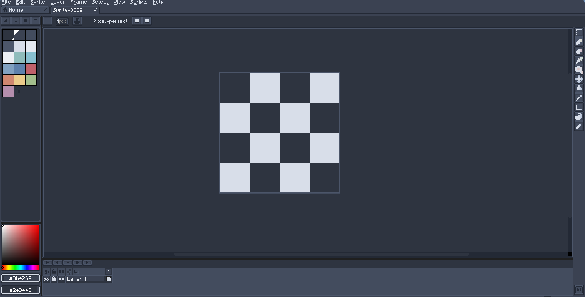

# LibreSprite-Nord-Theme


---


---



---

## 🧊 LibreSprite Nord Theme

A clean and minimal theme for LibreSprite, inspired by the Nord color palette. Designed for pixel artists who value clarity and calm UI aesthetics.

---

### 🔧 Installation – Basic Theme Only

```
git clone https://github.com/Lewenhart518/LibreSprite-Nord-Theme.git
```

1. Open the folder: `LibreSprite-Nord-Theme/assets/skins/Nord-Theme`
2. Copy the folder `Nord-Theme` to your LibreSprite skins directory:

**Windows**:  
```
C:\Users\<your-username>\AppData\Roaming\Libresprite\data\skins\
```

**Linux**:  
```
~/.config/libresprite/data/skins/
```

3. Launch LibreSprite and go to:  
   `Edit > Preferences > Theme`  
4. Select **Nord-Theme**, click **Select**, then **Apply**
5. Restart LibreSprite

---

### 🚀 Installation – Theme with Extras

```
git clone https://github.com/Lewenhart518/LibreSprite-Nord-Theme.git
```

1. Copy all contents of the repository into LibreSprite's `data` directory:

**Windows**:  
```
C:\Program Files\Libresprite\data\
```

**Linux**:  
```
/usr/share/libresprite/data/
```
*(You may need root permissions to modify this folder)*

2. Launch LibreSprite and go to:  
   `Edit > Preferences > Theme`  
3. Select **Nord-Theme**, click **Select**, then **Apply**
4. Restart LibreSprite — the logo and background should now reflect the Nord style

---
